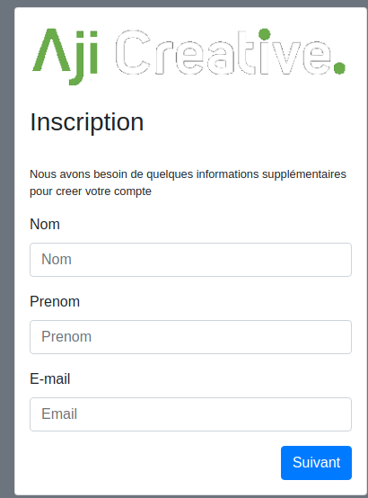

# Aji Creative News App

## Screenshots

### Login page
This is the main page of the app.
Click on "Creez-en un" to create a new user and get redirected on the access code page.


### Passcode page
Enter the admin access code that is 123456789.
And then click "Suivant" to be redirected to the registration page


### Registration page
Enter your details.
Then click "Suivant"



### Password page
Enter a Password.
Then click "Suivant"


### Feed page
Finally, you are redirected on the news feed page.


## Run Locally

Clone the project

```bash
  git clone https://github.com/smiletondi/AjiCreative-challenge.git
```

Go to the project directory

```bash
  cd AjiCreative-challenge
```

Install dependencies

```bash
  npm install
```

Start the server

```bash
  npm run start:dev
```

  
## Acknowledgements

 - [Superplate](https://github.com/pankod/superplate)
 - [README](https://readme.so)

  